# WireShark introdução 

O **Wireshark** é uma das ferramentas de análise de tráfego de rede mais poderosas disponíveis. Ele pode ser utilizado para diversos propósitos:

* **Detectar e solucionar problemas de rede**, como pontos de falha relacionados à carga da rede e congestionamentos.
* **Detectar anomalias de segurança**, como hosts não autorizados, uso anormal de portas e tráfego suspeito.
* **Investigar e estudar detalhes de protocolos**, como códigos de resposta e dados presentes nos payloads dos pacotes.

**Nota:** O Wireshark não é um **Sistema de Detecção de Intrusão (IDS — Intrusion Detection System)**. Ele apenas permite que analistas visualizem e investiguem os pacotes de rede detalhadamente. Além disso, o Wireshark não modifica os pacotes; ele apenas os captura e analisa. Portanto, a identificação de anomalias ou problemas de rede depende significativamente do conhecimento e das habilidades de investigação do analista.

## GUI e Dados

A **interface gráfica (GUI) do Wireshark** é aberta em uma única página que reúne as principais funcionalidades da ferramenta, permitindo que o usuário investigue o tráfego de rede de diferentes maneiras. À primeira vista, cinco seções principais se destacam.

| **Seção**                                                          | **Descrição**                                                                                                                                                                                                                                                                                                                                           |
| :----------------------------------------------------------------- | :------------------------------------------------------------------------------------------------------------------------------------------------------------------------------------------------------------------------------------------------------------------------------------------------------------------------------------------------------ |
| **Barra de Ferramentas (Toolbar)**                                 | A barra de ferramentas principal contém diversos menus e atalhos para captura e processamento de pacotes, incluindo funcionalidades de **filtragem, ordenação, resumo, exportação e mesclagem** de capturas.                                                                                                                                            |
| **Barra de Filtro de Exibição (Display Filter Bar)**               | Principal área utilizada para realizar consultas e aplicar filtros sobre os pacotes capturados.                                                                                                                                                                                                                                                         |
| **Arquivos Recentes (Recent Files)**                               | Lista dos arquivos analisados recentemente. É possível abrir novamente um arquivo listado dando um duplo clique sobre ele.                                                                                                                                                                                                                              |
| **Filtro de Captura e Interfaces (Capture Filter and Interfaces)** | Apresenta os **filtros de captura** e os pontos disponíveis para captura de tráfego, ou seja, as **interfaces de rede**. Uma interface de rede representa o ponto de conexão entre um computador e uma rede. Interfaces de software, como `lo`, `eth0` e `ens33`, permitem que o sistema operacional interaja com o hardware e com os recursos de rede. |
| **Barra de Status (Status Bar)**                                   | Exibe informações relacionadas ao estado atual do Wireshark e da captura, como quantidade de pacotes capturados, pacotes exibidos após a aplicação de filtros e outras informações sobre a sessão de análise.                                                                                                                                           |
|                                                                    |                                                                                                                                                                                                                                                                                                                                                         |

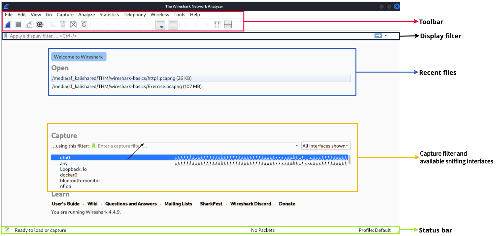

## Interpretação de Packets

Com o Wireshark, agora é possível abrir todas as informações estudadas nas camadas do modelo OSI, "desembrulhando" o pacote para podermos investigar as informações contidas nele. Na interface do Wireshark, é possível clicar em um dos pacotes para visualizar suas informações. Nesta figura, conseguimos ver os detalhes do pacote 27.

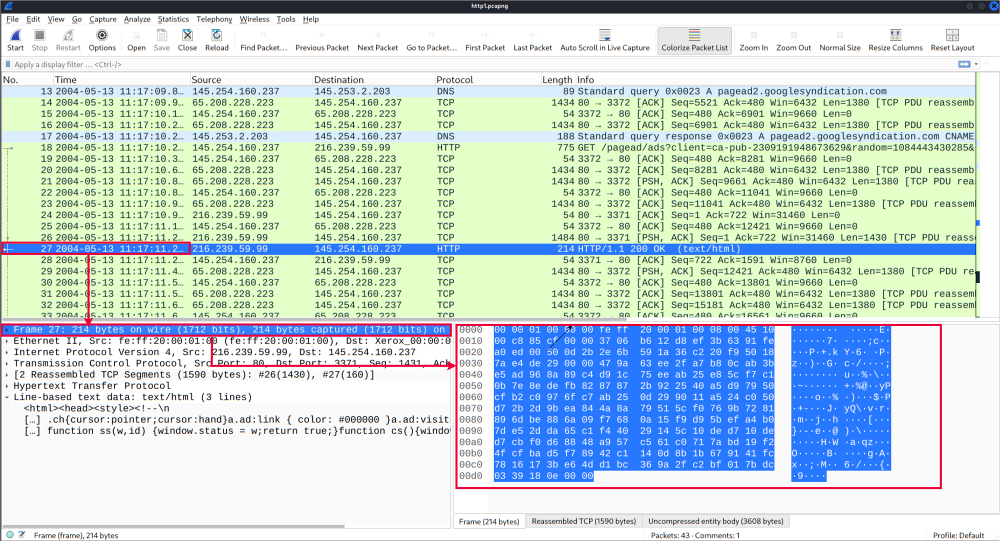

Olhando com atenção, é possível identificar diferentes seções de informações dentro do pacote: **Frame, Source [MAC], Source [IP], Protocol, Protocol Errors, Application Protocol e Application Data**. Cada uma dessas seções permite analisar informações relacionadas às diferentes camadas e protocolos envolvidos na comunicação.

??? note "Frame (Camada 1) - Camada Física"
    Esta seção mostra qual frame/pacote está sendo analisado e apresenta informações relacionadas à camada física do modelo OSI.

    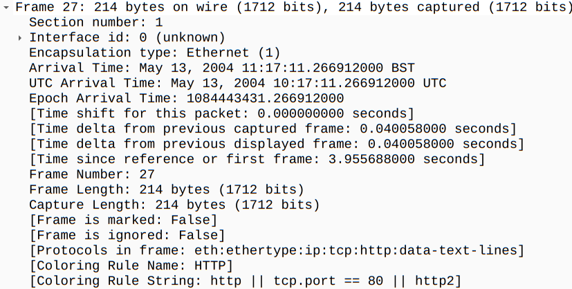

??? note "Source [MAC] (Camada 2) - Camada de Enlace"
    Esta seção apresenta os **endereços MAC de origem e destino** do pacote. Essas informações pertencem à camada de enlace de dados (Data Link) do modelo OSI.

    
    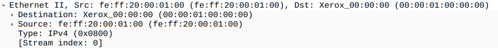
    

??? note "Source [IP] (Camada 3) - Camada de Rede"
    Esta seção apresenta os **endereços IPv4 de origem e destino** utilizados na comunicação. Essas informações pertencem à camada de rede (Network) do modelo OSI.

    
    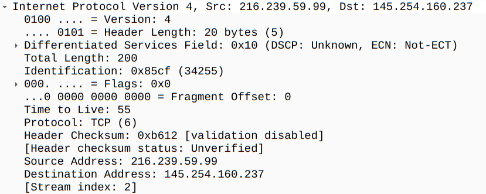
    

??? note "Protocol (Camada 4) - Camada de Transporte"
    Esta seção apresenta informações sobre o **protocolo de transporte utilizado**, como TCP ou UDP, além das **portas de origem e destino** da comunicação.

    
    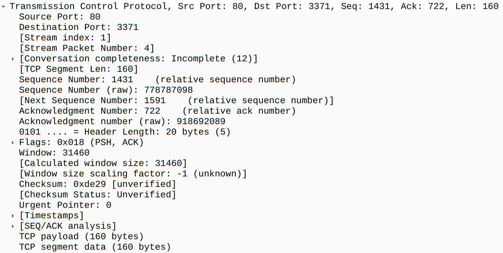
    

??? note "Protocol Errors - Informações adicionais da Camada 4"
    Esta seção pode apresentar informações adicionais relacionadas ao protocolo de transporte. No caso do TCP, por exemplo, pode indicar **segmentos que precisam ser remontados (reassembled)** para reconstruir os dados transmitidos.

    
    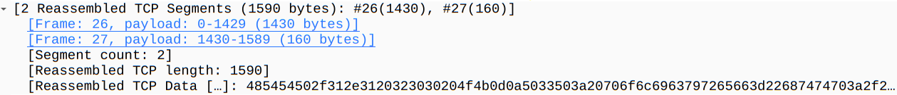
    

??? note "Application Protocol - Protocolo de Aplicação"
    Esta seção apresenta detalhes específicos sobre o **protocolo de aplicação** utilizado na comunicação, como HTTP, FTP ou SMB.

    
    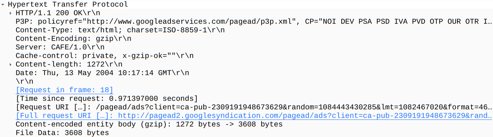
    

??? note "Application Data - Dados da Aplicação"
    Esta seção apresenta os **dados específicos da aplicação** transportados pelo pacote. Dependendo do protocolo utilizado e da presença ou ausência de criptografia, pode ser possível visualizar diretamente parte do conteúdo transmitido.

    
    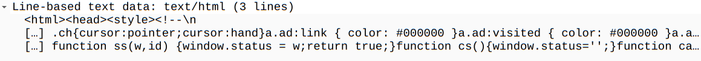
    

## Filtragem de packets

O Wireshark possui um poderoso mecanismo de filtragem que ajuda os analistas a restringir o tráfego analisado e focar nos eventos de interesse. O Wireshark possui dois tipos de filtros: **Capture Filters (filtros de captura)** e **Display Filters (filtros de exibição)**.

Os **Capture Filters** são utilizados para **capturar** apenas os pacotes que correspondem ao filtro aplicado. Já os **Display Filters** são utilizados para **visualizar** apenas os pacotes que correspondem ao filtro, sem remover os demais pacotes da captura.

As diferenças entre esses filtros e suas formas de uso mais avançadas serão abordadas posteriormente. Por enquanto, vamos focar no uso básico dos **Display Filters**, que são fundamentais durante as etapas iniciais de análise de tráfego.

### Display Filter

A maneira mais fácil de filtrar rapidamente uma grande quantidade de pacotes é aplicando um Display Filter (filtro de exibição) por meio da barra "Apply a display filter", mostrada na imagem abaixo.

Existem diversas consultas de filtragem disponíveis, e cada uma delas pode ser ajustada para apresentar resultados bastante específicos. Abaixo estão alguns filtros simples para começar.

Filtrar por nome do protocolo ou porta

Existem duas formas básicas de filtrar com base em um protocolo específico: pelo nome do protocolo ou pelo número da porta utilizada pelo protocolo.

Para filtrar pelo nome do protocolo, basta digitar o nome do protocolo na barra de filtro e pressionar Enter ou clicar no botão de seta localizado no lado direito da barra de Display Filter.

O gif abaixo mostra como aplicar um filtro para buscar requisisões do protocólo HTTP. Da mesma forma, é possível filtrar outros protocolos utilizando palavras-chave como arp, dhcp, ftp, smtp, pop, imap, entre outras.

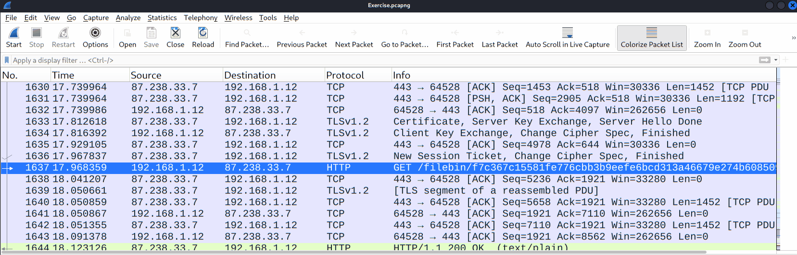

Para filtrar pelo **número da porta do protocolo**, é possível utilizar a estrutura `tcp.port == <número da porta>` ou `udp.port == <número da porta>`.

Por exemplo, caso você queira visualizar apenas pacotes relacionados ao tráfego **HTTP**, pode utilizar o seguinte filtro:

`tcp.port == 80`

Após inserir o filtro, basta pressionar **Enter** para aplicá-lo. O GIF abaixo demonstra um exemplo da utilização do filtro pela porta padrão do HTTP.

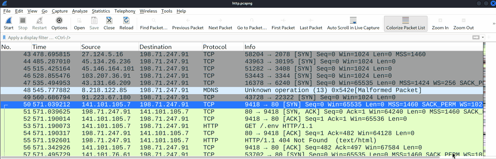
