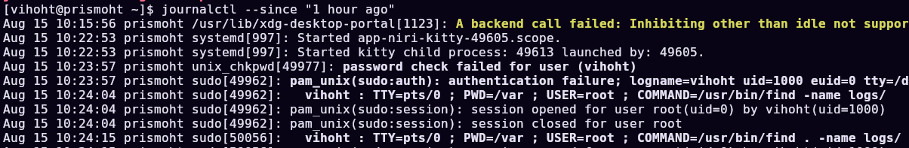

# Coleta de Logs e Monitoramento

## 1. Objetivo

Ao final da aula, os alunos deverão ser capazes de:

- compreender o papel dos logs em operações de segurança;
- identificar as principais fontes de logs em Windows e Linux;
- interpretar eventos básicos relacionados a autenticação, processos e alterações administrativas;
- entender o funcionamento e a arquitetura do Syslog;
- compreender as limitações dos logs nativos do Windows;
- entender como o Sysmon amplia a visibilidade sobre atividades do sistema;
- utilizar Event Viewer, Sysmon e ferramentas do Sysinternals para investigação inicial.


## 2. O que são Logs?


"Arquivos de log são arquivos gerados por software que contêm informações sobre as operações, as atividades e os padrões de uso de uma aplicação, servidor ou sistema de TI." [AWS-Amazon](https://aws.amazon.com/pt/what-is/log-files/)

São através dos logs que vemos o real funcionamente de uma aplicação. Neles podemos observar o histórico de processos, eventos do sistema, interaçoes com usuarios e mensagens descritivas de fluxos de operaçoes todos carimbados com data e hora do ocorrido, nos possibilitando a analise do sistema em funcionamento. 

Tome como exemplo o log abaixo.
```
2026-08-08 23:45:20
User: administrator
Source IP: 192.168.1.54
Event: Login failed 
Reason: Invalid Password
```
Nele podemos observar um usuário de nome "administrador" com o IP 192.168.1.54 tentou logar, mas forneceu a senha incorretamente. Isoladamente pode nao siginificar muito.

Mas imagine:
```
23:45:21 administrator LOGIN FAILED
23:45:21 administrator LOGIN FAILED
23:45:21 administrator LOGIN FAILED
... 20 ...
23:45:25 administrator LOGIN FAILED
23:45:25 administrator LOGIN FAILED
23:45:25 administrator LOGIN FAILED
```

Multiplas tentativas de login em tempos extremamente curtos podendo indicar um password guessing ou brute force da senha.

Aqui podemos fazer uma importante distinção, logs não são necessariamente um alerta, mas um importante indicador de uma possível falha ou comportamente indevido.

Já uma regra de detecção analisa tais casos e define o quanto tais comportamentos merecem atenção.


## 3. Por que Logs são importantes

Para o time de segurança Blue Team, logs são importantes principalmente para:

**Detecção e Resposta**

Identificar comportamentos potencialmente maliciosos e falhas nos fluxos de serviços.

A [ATT&CK detection strategies](https://attack.mitre.org/) mapeia 918+ estratégias de detecção e suas fontes de logs à ataques específicos, cada mapeamento é uma oportunidade de encontrar um potêncial comportamento malicioso e evitar que um ataque ocorra da fonte.

Ao detectar mais agilmente o ataque, o time de segurança tem mais tempo e recursos para mitigá-lo.

**Investigação e Forense** 

Reconstruir o fluxo e linha do tempo do que aconteceu após um alerta ou incidente.

Uma investigação normalmenete busca responder as seguintes perguntas.
```
Quem executou?
​        ↓
O que foi executado?
        ↓
Quando aconteceu?
        ↓
Em qual máquina?
        ↓
De qual origem?
        ↓
O que aconteceu depois?
```

Uma rota mostra um comportamento suspeito, um banco de dados mostra uma alteração não programado, um serviço mostra uma autenticação não usual. Separados esses logs transmitem informações pontuais, juntos podemos inferir um fluxo: 

Requisição -> Alteração do Banco de Dados -> Autenticação. 
>Possível Sql Injection seguido de Escalada de Privilégio

A combinação de diferentes tipos de logs permite recriação do fluxo de ataque, detecção da falha e o desenvolvimento de novas estratégias.

**Threat Hunting**

Pesquisar proativamente evidências de compromentimento ou ataque (IoC & IoA)

"Os programas de busca de ameaças são baseados em dados — especificamente, nos conjuntos de dados coletados pelos sistemas de detecção de ameaças de uma organização e outras soluções de segurança corporativa" [IBM - What is threat hunting?](https://www.ibm.com/think/topics/threat-hunting)   

A utilização ativa de logs para a detecção prematura de atividades maliciosas previnem ataques que passa, desapercebidos pelos sistemas de detecção, reforçando a segurança da organização.


## 4. Tipos de Logs

Podemos gerar e coletar logs em diversas partes da aplicação:

| Fonte                   | Exemplos de informação (logs)  | Exemplos de ameaças                                                   |
| ----------------------- | ------------------------------ | --------------------------------------------------------------------- |
| **Sistema operacional** | login, processos, serviços     | malware, escalada de privilégio, processos suspeitos                  |
| **Firewall**            | conexões permitidas/bloqueadas | port scanning, conexões com IPs maliciosos, comunicação C2            |
| **DNS**                 | consultas de domínio           | DNS tunneling, domínios maliciosos, DGA                               |
| **Proxy**               | acesso web                     | phishing, download de malware, acesso a sites maliciosos              |
| **Aplicações**          | erros e autenticação           | brute force, exploração de vulnerabilidades, abuso de autenticação    |
| **Active Directory**    | usuários e grupos              | password spraying, contas suspeitas, movimentação lateral             |
| **EDR**                 | processos e comportamento      | ransomware, credential dumping, PowerShell malicioso                  |
| **VPN**                 | acessos remotos                | credenciais comprometidas, brute force, acessos anômalos              |
| **Cloud**               | alterações administrativas     | abuso de privilégios, comprometimento de contas, alterações indevidas |
| **IDS/IPS**             | tráfego suspeito               | exploração de vulnerabilidades, scans, ataques conhecidos             |


> IDS/IPS: Intrusion Detection System / Intrusion Prevention System, sistemas que se complementao detectando e previnindo operações maliciosas <br>
> EDR: Endpoint Detection and Response, ferramenta que monitora dispositivos de ponta como celular e computadores.

Estas fontes dividem os logs em diversas outras categorias de acordo com suas funcionalidades.

Isso nos introduz um problema: Como podemos analisar logs de centenas ou milhares de maquianas em todas essas camadas?

Imagine abrir cada um dos logs anteriores de cada computador que se comunicou com sua aplicação, parece impossivel certo?

>Spoiler: Para isso usamos ferramentas como o SIEM e SOEM, ferramentas dedicadas a classificar, agrupar e lidar com tais informaçoes. Discutiremos mais na proxima aula.


## 5. Retenção de Logs

Gerar e coletar logs é apenas uma parte do processo. Para que essas informações possam ser utilizadas em uma investigação, elas precisam continuar disponíveis quando forem necessárias.

**Retenção de logs** é o período durante o qual os registros são armazenados antes de serem arquivados ou removidos.

Imagine que hoje identificamos uma comunicação suspeita com um servidor externo. Durante a investigação descobrimos que o primeiro contato com esse servidor ocorreu **há três meses.**

Se os logs forem mantidos por apenas 30 dias, parte importante da investigação já terá sido perdida.

Nesse cenário, a retenção dos logs influencia diretamente nossa capacidade de reconstruir **a linha do tempo de um incidente.**

### 5.1 Quanto tempo devemos armazenar os logs?

Não existe um único período de retenção adequado para todos os ambientes.

Segundo o [NIST SP 800-92](https://nvlpubs.nist.gov/nistpubs/legacy/sp/nistspecialpublication800-92.pdf), organizações devem estabelecer políticas para retenção de logs considerando requisitos operacionais, necessidades de segurança e requisitos legais ou regulatórios.

> NIST: National Institute of Standards and Technology

Na prática, a política pode variar de acordo com a fonte e com a importância do dado:

| Fonte                | Exemplo de log                                           | Por que manter?                                               |
| -------------------- | -------------------------------------------------------- | ------------------------------------------------------------- |
| **Active Directory** | autenticações, criação de usuários, alterações de grupos | investigar comprometimento de contas e escalada de privilégio |
| **Firewall**         | origem, destino, porta e conexões                        | reconstruir comunicações de rede                              |
| **DNS**              | consultas de domínio                                     | identificar comunicação com infraestrutura maliciosa          |
| **EDR/Sysmon**       | processos, conexões e alterações no sistema              | reconstruir atividades executadas em endpoints                |
| **VPN**              | usuário, IP e horário de conexão                         | investigar acessos remotos                                    |
| **Cloud**            | alterações administrativas e acessos                     | identificar abuso de privilégios e mudanças não autorizadas   |
| **Aplicações**       | autenticação, erros e requisições                        | investigar exploração de aplicações e abuso de contas         |

Quanto maior o período de retenção, maior será a janela histórica disponível para uma investigação. Porém, isso também significa **maior consumo de armazenamento e maior custo.**

Por isso, **reter tudo indefinidamente geralmente não é uma estratégia adequada.** É necessário encontrar um equilíbrio entre visibilidade, custo, requisitos legais e valor investigativo.

Uma arquitetura pode, por exemplo, separar os dados em:

```
Logs recentes
     ↓
HOT STORAGE
Consulta rápida
Investigações e alertas
     ↓
WARM / COLD STORAGE
Consultas menos frequentes
Menor custo
     ↓
ARQUIVAMENTO
Retenção de longo prazo
```

Essa estratégia permite manter períodos maiores de histórico sem necessariamente manter todos os dados no mesmo tipo de armazenamento.

## 6. Integridade dos logs

Retenção também não significa simplesmente guardar arquivos.

Durante uma investigação, precisamos confiar que o registro analisado representa aquilo que realmente aconteceu.

Um atacante que compromete uma máquina pode tentar, **apagar, modificar ou criar logs falsos,** dificultando a investigação.

Por isso, uma estratégia de logging deve considerar não apenas **por quanto tempo** os logs serão armazenados, mas também **onde** serão armazenados e **quem pode alterá-los ou removê-los.**

A centralização dos logs ajuda nesse processo. Mesmo que um atacante consiga apagar registros da máquina comprometida, uma cópia do evento pode já ter sido enviada para outro sistema.

```
Servidor comprometido
       │
       ├── Log local
       │      └── atacante tenta apagar
       │
       └──────────────► Servidor de Logs / SIEM
                              │
                              └── cópia preservada
```

Portanto, uma boa política de retenção deve responder pelo menos:

- Quais logs precisamos armazenar?
- Por quanto tempo?
- Quem pode acessá-los?
- Quem pode modificá-los ou removê-los?
- Como garantir sua integridade?


## 7. Fontes de Logs em Sistemas Operacionais

Sistemas operacionais são uma das principais fontes de logs para o Blue Team.

É no sistema operacional que conseguimos observar atividades diretamente relacionadas ao uso de uma máquina, como:

- Autenticação de usuários
- Execução de processos
- Inicialização de serviços
- Alterações no sistema
- Conexões de rede
- Erros e eventos de segurança

Esses registros ajudam a responder perguntas fundamentais durante uma investigação:

- Quem acessou a máquina?
- Quando o acesso ocorreu?
- Qual processo foi executado?
- Qual usuário executou?
- Algum serviço foi criado ou alterado?
- O sistema apresentou algum comportamento anormal?

Entretanto, Linux e Windows possuem arquiteturas diferentes para geração, armazenamento e consulta desses eventos.

Mas antes de analisarmos onde Linux e Windows armazenam seus logs, precisamos entender um conceito muito comum quando falamos sobre coleta de eventos: **Syslog.**

### 7.1 O que é Syslog?

Syslog é um padrão utilizado para geração, envio e centralização de mensagens de log entre diferentes sistemas e dispositivos

Diferente do que o nome pode sugerir, Syslog não é simplesmente um "arquivo de log". Ele define uma forma padronizada para que diferentes componentes possam enviar mensagens para um sistema responsável por coletá-las.

De forma simplificada:

```
Aplicação ─────┐
               │
Sistema ───────┤
               ├────► Syslog ────► Armazenamento
Firewall ──────┤
               │
Roteador ──────┘
```

Por exemplo, um servidor pode gerar uma mensagem informando uma falha de autenticação:

```
Aug 15 10:32:14 server01 sshd[4210]: Failed password for root from 192.168.1.54
```

```
Aug 15 10:32:14    → Quando?
server01           → Onde?
sshd               → Qual serviço?
Failed password    → O que aconteceu?
192.168.1.54       → De qual origem?
```

O Syslog permite que mensagens como essa sejam tratadas de maneira padronizada e, principalmente, encaminhadas para outros sistemas.

#### Como uma mensagem Syslog é classificada?

O Syslog também utiliza conceitos chamados Facility e Severity.

Facility indica, de maneira geral, qual tipo de sistema ou serviço originou a mensagem.

| Facility            | Origem                   |
| ------------------- | ------------------------ |
| `auth` / `authpriv` | autenticação e segurança |
| `cron`              | tarefas agendadas        |
| `daemon`            | serviços do sistema      |
| `kern`              | kernel                   |
| `mail`              | serviços de e-mail       |
| `user`              | processos de usuário     |

Já a Severity representa a gravidade da mensagem.

```
0  Emergency
1  Alert
2  Critical
3  Error
4  Warning
5  Notice
6  Informational
7  Debug
```

Quanto menor o número, maior a severidade.

Isso permite criar regras como:

> "Envie todos os eventos de autenticação com severidade igual ou superior a Warning para o servidor central."

No Windows, entretanto, a principal arquitetura nativa de logging é o Windows Event Log, e não o Syslog.

Essa diferença é importante:

| Linux / Unix                                | Windows                               |
| ------------------------------------------- | ------------------------------------- |
| Syslog é muito comum                        | Windows Event Log é nativo            |
| `/var/log/` é uma fonte comum               | eventos são armazenados em Event Logs |
| `rsyslog`, `syslog-ng`, `journald`          | Windows Event Log Service             |
| `journalctl`, arquivos e outras ferramentas | Event Viewer / PowerShell             |


Com essa base, podemos analisar como os dois principais sistemas operacionais encontrados em ambientes corporativos geram e disponibilizam seus eventos.

### 7.2 Linux

#### var/log

Em sistemas Linux, tradicionalmente muitos logs são armazenados como arquivos de texto dentro do diretório:

``` bash
/var/log/
```

Podemos visualizar alguns deles utilizando:
``` bash
ls -la /var/log/
```

Dependendo da distribuição Linux e dos serviços instalados, encontraremos diferentes arquivos.

Alguns exemplos comuns são:

| Log / Fonte         | Informação                                 | Possível uso em segurança                                   |
| ------------------- | ------------------------------------------ | ----------------------------------------------------------- |
| `/var/log/auth.log` | autenticação, `sudo`, SSH                  | brute force, acessos indevidos, abuso de privilégios        |
| `/var/log/secure`   | autenticação e segurança                   | tentativas de login e uso de `sudo`                         |
| `/var/log/syslog`   | eventos gerais do sistema e serviços       | falhas, comportamentos anormais e eventos de serviços       |
| `/var/log/messages` | mensagens gerais do sistema                | erros, serviços e eventos do sistema                        |
| `/var/log/kern.log` | mensagens do kernel                        | alterações e problemas relacionados ao kernel               |
| `/var/log/cron`     | execução de tarefas agendadas              | persistência e execução suspeita via cron                   |
| `auditd`            | chamadas de sistema e eventos de auditoria | execução, alterações de arquivos e atividades privilegiadas |

>Importante: os arquivos disponíveis variam entre distribuições. Por exemplo, sistemas baseados em Debian/Ubuntu normalmente utilizam auth.log, enquanto distribuições baseadas em [RHEL](https://www.redhat.com/pt-br/technologies/linux-platforms/enterprise-linux) tradicionalmente utilizam /var/log/secure.

**Exemplo — Tentativas de autenticação SSH**

Imagine encontrarmos no auth.log:

```
Aug 08 23:45:21 server sshd[4210]: Failed password for root from 192.168.1.54 port 49120 ssh2
Aug 08 23:45:22 server sshd[4212]: Failed password for root from 192.168.1.54 port 49122 ssh2
Aug 08 23:45:22 server sshd[4214]: Failed password for root from 192.168.1.54 port 49124 ssh2
Aug 08 23:45:23 server sshd[4216]: Failed password for root from 192.168.1.54 port 49126 ssh2
```

Podemos identificar algumas informações importantes:

```
Usuário alvo → root
Origem       → 192.168.1.54
Serviço      → SSH
Resultado    → Failed password
```

Novamente, um único erro de senha pode não representar uma ameaça.

Mesmo IP
   +
Mesmo usuário
   +
Muitas tentativas
   +
Curto intervalo de tempo
        ->
Possível Brute Force

Podemos pesquisar eventos utilizando ferramentas tradicionais como grep:

``` bash
grep "Failed password" /var/log/auth.log
```

Ou procurar atividades relacionadas a determinado endereço IP:

``` bash
grep "192.168.1.54" /var/log/auth.log
```

#### systemd e journalctl

No Kali linux e em muitas distribuições modernas do Linux, uma fonte importante de logs é o **systemd journal**

**systemd** é o gerenciador de sistema e serviços padrão do linux, ele executa, gerencia e monitora os programas e sistemas internos que roda no sistema operacional.
**systemd-journal** é o componente do systemd que coleta, armazena e gerência os logs provenientes destes serviços/sistemas

Para consultar esses eventos utilizamos:
``` bash
journalctl
```
Por exemplo, podemos visualizar eventos relacionados ao serviço SSH:
``` bash
journalctl -u ssh
```
Ou eventos recentes:
``` bash
journalctl --since "1 hour ago"
```


> Logs do sistema identificando um usuário acessando as pastas de logs do sistema

Isso é muito util porque durante uma investigação não queremos necessariamente analisar milhares de linhas manualmente.

Podemos só **filtrar os eventos relevantes a nossa investigação.**

> Se abilitado em seu sistema, utilize o commando `journalctl -f` para ver os logs em tempo real

### 7.3 Windows

No Windows, a arquitetura é diferente.

Em vez de depender principalmente de arquivos de texto em /var/log, o Windows registra grande parte de seus eventos através do Windows Event Log.

Esses eventos podem ser visualizados através do:

#### Event Viewer — Visualizador de Eventos

Podemos acessá-lo executando pressionando `Windows + R` e execultando:
``` powershell
eventvwr.msc
```

Os logs encontrados em:

```
Windows Logs
│
├── Application
├── Security
├── Setup
├── System
└── Forwarded Events
```
possuem diferentes responsabilidades.

| Log                  | Informação                                                 |
| -------------------- | ---------------------------------------------------------- |
| **Application**      | eventos gerados por aplicações                             |
| **Security**         | autenticação, auditoria e eventos relacionados à segurança |
| **Setup**            | instalação e configuração de componentes                   |
| **System**           | eventos relacionados ao Windows, drivers e serviços        |
| **Forwarded Events** | eventos recebidos de outros computadores                   |


#### Event Id

Uma característica importante dos logs do Windows é o Event ID.

O Event ID identifica o tipo de evento registrado.

Por exemplo:

| Event ID | Evento                                               |
| -------: | ---------------------------------------------------- |
| **4624** | login realizado com sucesso                          |
| **4625** | tentativa de login falhou                            |
| **4634** | sessão encerrada                                     |
| **4648** | tentativa de login utilizando credenciais explícitas |
| **4688** | criação de um novo processo                          |
| **4720** | criação de uma conta de usuário                      |
| **4728** | usuário adicionado a um grupo global de segurança    |
| **4732** | usuário adicionado a um grupo local de segurança     |
| **1102** | log de auditoria foi apagado                         |

> Nem todos os eventos são necessariamente registrados por padrão. A visibilidade disponível depende, entre outros fatores, das políticas de auditoria configuradas no Windows.

**Exemplo — Falha de autenticação**

Durante uma investigação encontramos:

```
Event ID: 4625

Account Name: administrator
Source Network Address: 192.168.1.54
Failure Reason: Unknown user name or bad password
```

```
Quem?
administrator

De onde?
192.168.1.54

O que aconteceu?
Tentativa de autenticação

Resultado?
Falha
```

Um evento 4625 isolado provavelmente não é suficiente para determinar um ataque.

Porém:

```
4625
4625
4625
4625
4625
4625
4625
4625
  ↓
Mesmo usuário
Mesmo IP
Poucos segundos
  ↓
Possível Brute Force
```

Aqui voltamos ao conceito apresentado no começo:
> O log registra o evento. A detecção interpreta o comportamento.

#### Processos no Windows

Além de autenticação, processos são extremamente importantes para uma investigação.

Um exemplo é o Event ID 4688, que registra a criação de um novo processo quando a auditoria correspondente está habilitada.

Imagine observarmos:

```
Event ID: 4688

New Process Name:
C:\Windows\System32\WindowsPowerShell\v1.0\powershell.exe

Creator Process:
C:\Windows\System32\cmd.exe

Account Name:
administrator
```

O evento nos informa que:

```
cmd.exe
   │
   └── powershell.exe
```

Isso começa a formar algo extremamente importante em segurança: uma árvore de processos.

Por exemplo:

winword.exe -> cmd.exe -> powershell.exe

Essa sequência pode ser muito mais interessante para um analista do que simplesmente saber que powershell.exe foi executado.

> O contexto e a relação entre os eventos é que ajudam a determinar se uma atividade é normal ou potencialmente maliciosa.


### 7.4 Limitações dos logs nativos

Apesar da quantidade de informações disponíveis no Windows Event Log e no Journalctl, nem toda atividade relevante possui a profundidade necessária para uma investigação.

Dependendo das configurações de auditoria e da atividade investigada, os logs nativos podem não fornecer a visibilidade necessária.

É justamente nesse ponto que ferramentas adicionais tornam-se importantes.

Uma das principais é o Sysmon, da suíte Sysinternals, que amplia significativamente a telemetria disponível sobre processos, conexões e outras atividades do sistema.

```
Windows Event Logs
        +
Auditoria do Windows
        +
Sysmon
        ↓
Maior visibilidade
        ↓
Melhor capacidade de investigação
```

Essa diferença entre o que o Windows registra nativamente e o que conseguimos observar com o Sysmon será explorada nas próximas seções.

Mas antes: [Sherlock HackTheBox - Log Jammer](https://app.hackthebox.com/sherlocks/LogJammer?tab=play_sherlock)


## 8. Sysmon
### 8.1 Instalação do Sysmon

O **System Monitor**, mais conhecido como Sysmon, é uma ferramenta da suíte Sysinternals que amplia a visibilidade sobre as atividades realizadas em sistemas Windows.

Depois de instalado, o Sysmon permanece em execução como um serviço do sistema e registra eventos relacionados a:

- criação de processos;
- conexões de rede;
- consultas DNS;
- criação e remoção de arquivos;
- carregamento de drivers;
- alterações no Registro do Windows;
- criação de named pipes;
- diversas outras atividades do sistema.

O Sysmon pode ser baixado na página oficial da Microsoft:

[Microsoft Sysinternals — Sysmon](https://learn.microsoft.com/br/sysinternals/downloads/sysmon)

Após o download, extraia o conteúdo do arquivo ZIP. Teremos arquivos semelhantes a:

```
Sysmon.exe
Sysmon64.exe
Sysmon64a.exe
Eula.txt
```

Em sistemas Windows de 64 bits, normalmente utilizamos o executável:

`Sysmon64.exe`

Abra o PowerShell como administrador, acesse a pasta em que o Sysmon foi extraído e execute:

```powershell
cd C:\Tools\Sysmon
```

Para instalar o Sysmon com a configuração padrão:

```powershell
.\Sysmon64.exe -accepteula -i
```

O parâmetro -accepteula aceita o contrato de licença e o parâmetro -i instala o serviço e o driver do Sysmon.

Não é necessário reiniciar o Windows depois da instalação.

Podemos verificar se o serviço está em execução com:

```powershell
Get-Service Sysmon64
```

Também podemos consultar a configuração ativa:

```powershell
.\Sysmon64.exe -c
```

A configuração padrão registra apenas parte dos eventos disponíveis. Por exemplo, o monitoramento de conexões de rede, Event ID 3, é desabilitado por padrão. Em ambientes reais, o Sysmon normalmente é instalado com um arquivo de configuração XML que define quais atividades devem ser registradas.

Para instalar utilizando um arquivo de configuração:

```powershell
.\Sysmon64.exe -accepteula -i .\sysmonconfig.xml
```

Caso o Sysmon já esteja instalado, podemos atualizar sua configuração com:

```powershell
.\Sysmon64.exe -c .\sysmonconfig.xml
```

Para remover o Sysmon:

```powershell
.\Sysmon64.exe -u
```

### 8.2 Onde os eventos são armazenados?

O Sysmon não possui uma interface própria para visualização dos eventos.

Seus registros são enviados para a infraestrutura padrão do Windows Event Log e podem ser encontrados no Event Viewer.

Abra o Visualizador de Eventos executando:

```powershell
# Crtl+Shift+D
eventvwr.msc
```

Depois, navegue até:
```
Applications and Services Logs
└── Microsoft
    └── Windows
        └── Sysmon
            └── Operational
```
Também podemos acessar diretamente esse log utilizando PowerShell:

```powershell
Get-WinEvent -LogName "Microsoft-Windows-Sysmon/Operational"
```

Para mostrar apenas os dez eventos mais recentes:

```powershell
Get-WinEvent `
  -LogName "Microsoft-Windows-Sysmon/Operational" `
  -MaxEvents 10
```

Os timestamps registrados pelo Sysmon utilizam UTC. Durante uma investigação, é importante considerar o fuso horário antes de relacionar eventos do Sysmon com outras fontes de logs.

### 8.3 Por que utilizar o Sysmon?

Os logs nativos do Windows podem registrar a criação de processos através do Event ID 4688.

Entretanto, a quantidade de informações disponíveis depende das políticas de auditoria configuradas no sistema.

O Sysmon pode fornecer informações adicionais, como:

```
Processo executado
        +
Linha de comando completa
        +
Processo pai
        +
Usuário
        +
Hash do executável
        +
Process GUID
        ↓
Maior contexto para investigação
```

Considere o seguinte evento:

```
Event ID: 1

Image:
C:\Windows\System32\WindowsPowerShell\v1.0\powershell.exe

CommandLine:
powershell.exe -EncodedCommand SQBFAFgA...

ParentImage:
C:\Program Files\Microsoft Office\root\Office16\WINWORD.EXE

User:
FORELA\robson
```

Analisando apenas o nome powershell.exe, não podemos concluir que ocorreu um ataque.

Entretanto, a relação entre os processos fornece um contexto importante:
```
WINWORD.EXE
    │
    └── powershell.exe
            │
            └── comando codificado
```
Um documento do Microsoft Word iniciando PowerShell com um comando codificado pode indicar a execução de um documento malicioso.

Novamente:

O Sysmon registra o evento. O analista interpreta o comportamento.

### 8.4 Principais Event IDs do Sysmon

Os Event IDs do Sysmon são diferentes dos Event IDs encontrados no log Security do Windows.

|Event ID |	Evento |	Possível uso em uma investigação |
| -------- | ------------- | -------------- |
|1 | Process Create |	identificar processos, comandos e relações entre processos |
|2 |	File Creation Time Changed |	detectar alteração de timestamps ou possível timestomping |
|3 |	Network Connection |	relacionar um processo a uma conexão de rede |
|4 |	Sysmon Service State Changed |	identificar  inicialização ou interrupção do Sysmon |
|5	|Process Terminated	|determinar quando um processo foi encerrado|
|6	|Driver Loaded	|identificar drivers carregados no sistema|
|7	|Image Loaded	|identificar DLLs e módulos carregados por processos|
|8	|CreateRemoteThread	|investigar possível injeção de código|
|10	|Process Access	|investigar acesso à memória de outros processos|
|11	|File Create	|identificar arquivos criados ou sobrescritos|
|12–14	|Registry Events	|identificar criação, alteração ou remoção de chaves e valores|
|17–18	|Pipe Events	|identificar criação e conexão de named pipes|
|19–21	|WMI Events	|investigar execução e persistência através de WMI|
|22	|DNS Query	|identificar domínios consultados por um processo|
|23 e 26	|File Delete	|identificar arquivos removidos|
|25	|Process Tampering	|identificar técnicas de manipulação de processos|
|255	|Sysmon Error	|identificar erros internos na coleta de telemetria|

Alguns desses eventos podem gerar uma quantidade muito grande de logs. Por isso, eventos como carregamento de imagens, acesso entre processos e conexões de rede devem ser habilitados com filtros adequados.

### 8.5 Event ID 1 — Criação de processo

O Event ID 1 é um dos eventos mais importantes para investigações.

Ele registra informações como:

- UtcTime
- ProcessGuid
- ProcessId
- Image
- CommandLine
- CurrentDirectory
- User
- Hashes
- ParentProcessGuid
- ParentProcessId
- ParentImage
- ParentCommandLine

Imagine o seguinte evento:

```powershell
Event ID: 1

Image:
C:\Windows\System32\cmd.exe

CommandLine:
cmd.exe /c whoami

ParentImage:
C:\Windows\System32\WindowsPowerShell\v1.0\powershell.exe

User:
FORELA\administrator
```


Esse evento permite construir a seguinte relação:
```
powershell.exe
    │
    └── cmd.exe
            │
            └── whoami
```
Essa relação é conhecida como árvore de processos.

Uma árvore de processos ajuda a responder:

Qual processo foi executado?
Qual comando foi utilizado?
Quem realizou a execução?
Qual processo iniciou essa atividade?
O comportamento faz sentido para aquela aplicação?

Podemos procurar eventos de criação de processo com PowerShell:

```powershell
Get-WinEvent `
  -FilterHashtable @{
    LogName = "Microsoft-Windows-Sysmon/Operational"
    Id      = 1
  } `
  -MaxEvents 10
### 8.6 Event ID 3 — Conexão de rede
```

Quando habilitado na configuração, o Event ID 3 relaciona uma conexão de rede ao processo responsável por iniciá-la.

Exemplo:
```
Event ID: 3

Image:
C:\Users\robson\AppData\Local\Temp\update.exe

User:
FORELA\robson

DestinationIp:
203.0.113.54

DestinationPort:
443

Protocol:
tcp
```

O evento permite relacionar:
```
update.exe
    │
    └── conexão TCP
            │
            ├── destino: 203.0.113.54
            └── porta: 443
```

Uma conexão com a porta 443 não é necessariamente maliciosa.

Porém:
```
Executável em pasta temporária
        +
Processo desconhecido
        +
Conexão com IP externo
        +
Ocorrência fora do padrão
        ↓
Atividade que deve ser investigada
### 8.7 Event ID 11 — Criação de arquivo
```

O Event ID 11 registra a criação ou sobrescrita de arquivos.

Exemplo:

```powershell
Event ID: 11

Image:
C:\Windows\System32\WindowsPowerShell\v1.0\powershell.exe

TargetFilename:
C:\Users\robson\AppData\Local\Temp\payload.exe
```

Esse evento permite determinar:

qual arquivo foi criado;
onde foi armazenado;
quando foi criado;
qual processo realizou a operação.

Durante uma investigação, podemos correlacionar diferentes eventos:

```
Event ID 1
PowerShell executado
        │
        ▼
Event ID 22
Consulta de domínio
        │
        ▼
Event ID 3
Conexão com servidor externo
        │
        ▼
Event ID 11
Arquivo payload.exe criado
```

Separadamente, cada evento descreve uma atividade.

Quando correlacionados, eles ajudam a reconstruir a sequência do ataque.

### 8.8 Filtrando eventos com PowerShell

Para visualizar apenas eventos de criação de processos:

```powershell
Get-WinEvent `
  -FilterHashtable @{
    LogName = "Microsoft-Windows-Sysmon/Operational"
    Id      = 1
  }
```

Para visualizar eventos de conexão de rede:

```powershell
Get-WinEvent `
  -FilterHashtable @{
    LogName = "Microsoft-Windows-Sysmon/Operational"
    Id      = 3
  }
```

Para procurar mais de um Event ID:

```powershell
Get-WinEvent `
  -FilterHashtable @{
    LogName = "Microsoft-Windows-Sysmon/Operational"
    Id      = 1, 3, 11, 22
  } `
  -MaxEvents 50
```

Para limitar a pesquisa à última hora:

```powershell
$inicio = (Get-Date).AddHours(-1)

Get-WinEvent `
  -FilterHashtable @{
    LogName  = "Microsoft-Windows-Sysmon/Operational"
    Id       = 1, 3, 11, 22
    StartTime = $inicio
  }
```

Também podemos procurar uma palavra dentro das mensagens:

```powershell
Get-WinEvent `
  -LogName "Microsoft-Windows-Sysmon/Operational" |
Where-Object {
  $_.Message -match "powershell.exe"
}
### 8.9 Atividade prática
```

Depois de instalar o Sysmon, abra o PowerShell e execute:
```powershell
whoami
ipconfig
notepad.exe
```
Em seguida, abra o Event Viewer e navegue até:

Applications and Services Logs
→ Microsoft
→ Windows
→ Sysmon
→ Operational

Filtre o log pelo Event ID 1 e procure os processos:

whoami.exe
ipconfig.exe
notepad.exe

Para cada processo, identifique:

1. Quando foi executado?
2. Qual usuário realizou a execução?
3. Qual foi a linha de comando?
4. Qual foi o processo pai?
5. Qual é o hash do executável?

Depois, tente reconstruir a árvore de processos:

powershell.exe
    ├── whoami.exe
    ├── ipconfig.exe
    └── notepad.exe

O objetivo da atividade não é apenas encontrar um Event ID.

O objetivo é utilizar os campos do evento para responder:
```
Quem executou?
        ↓
O que foi executado?
        ↓
Quando aconteceu?
        ↓
Qual processo iniciou a execução?
        ↓
O que aconteceu depois?
```
### 8.10 Considerações sobre configuração

Instalar o Sysmon não significa que todos os eventos serão coletados automaticamente.

A configuração determina:

quais eventos serão registrados;
quais processos serão incluídos ou excluídos;
quais algoritmos de hash serão utilizados;
quais conexões de rede serão armazenadas;
quais diretórios ou alterações serão monitorados.

Uma configuração que registra tudo pode gerar muitos eventos, consumir armazenamento e dificultar a investigação.

Uma configuração excessivamente restritiva pode deixar de registrar atividades importantes.

Portanto, uma boa configuração deve buscar equilíbrio entre:
```
Visibilidade
    +
Volume de eventos
    +
Capacidade de armazenamento
    +
Necessidades de investigação
```
O Sysmon também não determina automaticamente se uma atividade é maliciosa.

Segundo a documentação da Microsoft, seus eventos são observacionais. O significado aparece quando os eventos são relacionados ao contexto e correlacionados em uma linha do tempo.

Para finalizar: [Shelock - Unit32](https://app.hackthebox.com/sherlocks/Unit42?tab=play_sherlock)


## Fontes Auxiliares

[Panther - What security logs](https://panther.com/blog/what-are-security-logs)

[NIST 800-92](https://nvlpubs.nist.gov/nistpubs/legacy/sp/nistspecialpublication800-92.pdf)

[IBM - What is threat hunting](https://www.ibm.com/think/topics/threat-hunting)

[RHEL - Red Hat Enterprise Linux](https://www.redhat.com/pt-br/technologies/linux-platforms/enterprise-linux)

[ArchLinux - Systemd](https://wiki.archlinux.org/title/Systemd)

[HackTheBox - Decoding Windows event logs: A definitive guide for incident responders](https://www.hackthebox.com/blog/decoding-windows-event-logs-a-definitive-guide-for-incident-responders)

[Microsoft Sysinternals — Sysmon](https://learn.microsoft.com/en-us/sysinternals/downloads/sysmon)

[Microsoft Learn — Understanding Sysmon events](https://learn.microsoft.com/en-us/windows/security/operating-system-security/sysmon/sysmon-events)